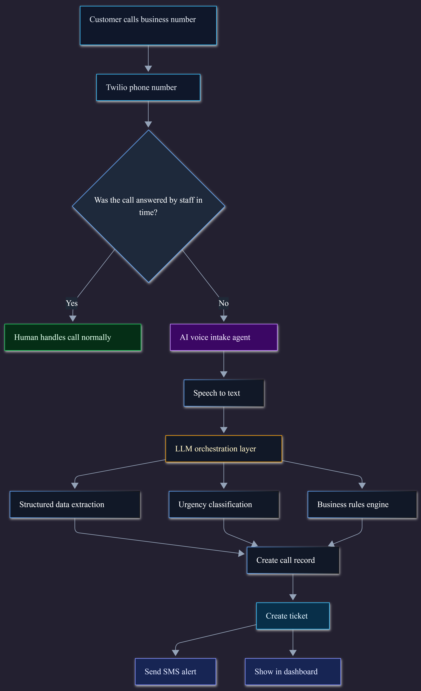
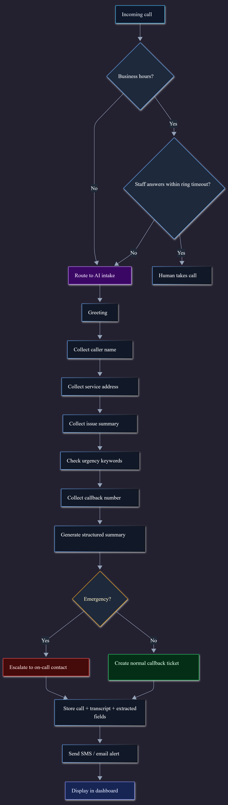
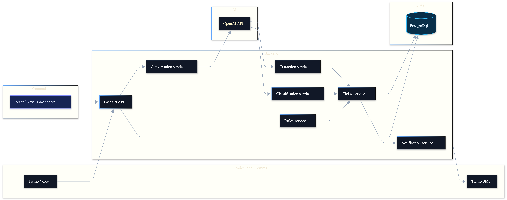

# OnCallHQ AI Intake MVP — Product Requirements Document (PRD)

> **Version:** 1.0
> **Last Updated:** 2026-04-08
> **Status:** MVP — Plumbing vertical only
> **Repo:** `OnCallHQ/oncallhq-ai-intake-mvp`

---

## Table of Contents

- [1. Product Overview](#1-product-overview)
- [2. Problem Statement](#2-problem-statement)
- [3. MVP Goal](#3-mvp-goal)
- [4. MVP Scope](#4-mvp-scope)
- [5. Architecture](#5-architecture)
- [6. Database Schema](#6-database-schema)
- [7. Backend (BE) Specification](#7-backend-be-specification)
- [8. Frontend (FE) Specification](#8-frontend-fe-specification)
- [9. Integrations](#9-integrations)
- [10. Security & Reliability](#10-security--reliability)
- [11. Build Decisions & Constraints](#11-build-decisions--constraints)
- [12. Open Questions](#12-open-questions)
- [13. Development Phases](#13-development-phases)

---

## 1. Product Overview

OnCallHQ is an AI intake and dispatch assistant for home service businesses, starting with plumbing. It captures missed and after-hours calls, extracts structured job information, classifies urgency, and notifies the contractor — all without quoting pricing.

The product competes with traditional answering services by providing faster, structured, always-on intake with a real-time dashboard.

---

## 2. Problem Statement

Home service contractors (plumbers, HVAC, electricians) lose revenue from missed calls — especially after-hours. Existing answering services are expensive, slow, and produce unstructured notes that require manual follow-up.

**OnCallHQ solves this by:**

- Answering missed calls with an AI voice agent
- Extracting structured job details automatically
- Classifying urgency so contractors prioritize correctly
- Sending instant SMS summaries so no job slips through
- Providing a dashboard for full visibility

---

## 3. MVP Goal

| Capability | Included | Notes |
|---|---|---|
| Answer missed / after-hours calls | Yes | Via Twilio + AI voice agent |
| Collect name, phone, address, issue, urgency | Yes | Structured extraction |
| Quote pricing | **No** | Intentionally excluded to avoid trust issues |
| Create structured ticket | Yes | Persisted to PostgreSQL |
| Send SMS summary to contractor | Yes | Via Twilio SMS |
| Dashboard visibility | Yes | Next.js internal dashboard |

---

## 4. MVP Scope

### In Scope (Build)

- Missed call handling via Twilio
- AI-powered structured intake conversation
- Urgency classification
- Ticket creation and persistence
- SMS notification to contractor
- Internal contractor dashboard

### Out of Scope (Do NOT Build)

- Pricing engine
- Full CRM
- Scheduling / booking system
- Mobile app
- Multi-tenant architecture (defer)
- Customer-facing portal

---

## 5. Architecture

### High-Level Architecture



**Flow:**

1. Customer calls business number → routed through Twilio
2. If staff doesn't answer within timeout → AI voice intake agent handles the call
3. Speech-to-text converts conversation
4. LLM orchestration layer performs:
   - Structured data extraction (name, phone, address, issue)
   - Urgency classification (low / medium / high / emergency)
   - Business rules evaluation
5. Call record and ticket are created
6. SMS alert sent to contractor + ticket displayed in dashboard

### Call Flow



**Detailed sequence:**

1. Incoming call → check business hours
2. If business hours → ring staff with timeout
3. If no answer OR after-hours → route to AI intake
4. AI greeting → collect caller name → collect service address → collect issue summary → check urgency keywords → collect callback number
5. Generate structured summary
6. If emergency → escalate to on-call contact immediately
7. If not emergency → create normal callback ticket
8. Store call + transcript + extracted fields
9. Send SMS / email alert
10. Display in dashboard

### System Components



**Component map:**

```
Twilio Voice ──→ FastAPI API ──→ Conversation Service ──→ OpenAI API
                      │                    │
                      │              Extraction Service ──→ PostgreSQL
                      │              Classification Service ──→ Ticket Service
                      │              Rules Service
                      │                    │
React/Next.js ◄──────┘          Notification Service ──→ Twilio SMS
Dashboard
```

### Tech Stack

| Layer | Technology |
|---|---|
| Frontend | Next.js 14 (App Router), React 18, TypeScript, Tailwind CSS |
| Backend | FastAPI, Python 3, Pydantic v2 |
| AI/LLM | OpenAI API (GPT-4 for extraction + classification) |
| Voice/SMS | Twilio (Voice + SMS) |
| Database | PostgreSQL 16 (Supabase or Neon for hosted) |
| Hosting | Vercel (frontend), Railway or Render (backend) |
| Local Dev | Docker Compose (PostgreSQL), uvicorn, npm run dev |

---

## 6. Database Schema

### `accounts`

| Column | Type | Notes |
|---|---|---|
| id | UUID | PK |
| business_name | VARCHAR | |
| email | VARCHAR | |
| phone | VARCHAR | |
| industry_type | VARCHAR | Default: `plumbing` |
| created_at | TIMESTAMP | |

### `users`

| Column | Type | Notes |
|---|---|---|
| id | UUID | PK |
| account_id | UUID | FK → accounts |
| name | VARCHAR | |
| email | VARCHAR | |
| role | VARCHAR | `owner`, `dispatcher`, `technician` |

### `calls`

| Column | Type | Notes |
|---|---|---|
| id | UUID | PK |
| account_id | UUID | FK → accounts |
| from_number | VARCHAR | Caller phone |
| to_number | VARCHAR | Business number |
| started_at | TIMESTAMP | |
| duration | INTEGER | Seconds |
| transcript | TEXT | Full conversation text |
| summary | TEXT | LLM-generated summary |

### `call_extractions`

| Column | Type | Notes |
|---|---|---|
| id | UUID | PK |
| call_id | UUID | FK → calls |
| caller_name | VARCHAR | Extracted |
| phone | VARCHAR | Callback number |
| address | VARCHAR | Service location |
| issue | TEXT | Problem description |
| urgency | VARCHAR | `low`, `medium`, `high`, `emergency` |
| emergency | BOOLEAN | Quick-flag for escalation |

### `tickets`

| Column | Type | Notes |
|---|---|---|
| id | UUID | PK |
| call_id | UUID | FK → calls |
| account_id | UUID | FK → accounts |
| status | VARCHAR | `new`, `acknowledged`, `in_progress`, `resolved`, `closed` |
| priority | VARCHAR | `low`, `medium`, `high`, `emergency` |
| customer_name | VARCHAR | |
| phone | VARCHAR | |
| issue_summary | TEXT | |
| created_at | TIMESTAMP | |
| updated_at | TIMESTAMP | |

### `notifications`

| Column | Type | Notes |
|---|---|---|
| id | UUID | PK |
| ticket_id | UUID | FK → tickets |
| type | VARCHAR | `sms`, `email` |
| recipient | VARCHAR | Phone or email |
| status | VARCHAR | `pending`, `sent`, `failed` |
| sent_at | TIMESTAMP | |

---

## 7. Backend (BE) Specification

### Services

| Service | Responsibility |
|---|---|
| `telephony_service` | Handle Twilio webhooks (incoming call, call status), manage call routing logic |
| `conversation_service` | Manage AI voice interaction with caller, drive the intake conversation flow |
| `extraction_service` | Parse call transcript → structured fields (name, phone, address, issue) via OpenAI |
| `classification_service` | Determine urgency level from extracted issue + keyword matching |
| `rules_service` | Apply business rules (business hours, service area, emergency escalation thresholds) |
| `ticket_service` | Create and manage ticket records in PostgreSQL |
| `notification_service` | Send SMS/email alerts to contractor via Twilio |

### API Endpoints

#### Auth

| Method | Path | Description |
|---|---|---|
| POST | `/auth/login` | Authenticate contractor/dispatcher |
| GET | `/auth/me` | Return current user profile |

#### Calls

| Method | Path | Description |
|---|---|---|
| GET | `/calls` | List all calls for account |
| GET | `/calls/{id}` | Get call detail with transcript + extraction |

#### Tickets

| Method | Path | Description |
|---|---|---|
| GET | `/tickets` | List tickets (filterable by status, priority) |
| GET | `/tickets/{id}` | Get full ticket detail |
| PATCH | `/tickets/{id}` | Update ticket status |

#### Settings

| Method | Path | Description |
|---|---|---|
| GET | `/settings` | Get account settings (business hours, service area, on-call number) |
| PATCH | `/settings` | Update account settings |

#### Twilio Webhooks

| Method | Path | Description |
|---|---|---|
| POST | `/webhooks/incoming-call` | Twilio sends this when a call comes in — triggers AI intake flow |
| POST | `/webhooks/call-status` | Twilio sends call status updates (completed, failed, etc.) |

#### Health

| Method | Path | Description |
|---|---|---|
| GET | `/health` | Readiness check — returns `{"status": "ok"}` |

### Backend Directory Structure (Target)

```
backend/
├── app/
│   ├── __init__.py
│   ├── main.py                    # FastAPI app, CORS, router includes
│   ├── config.py                  # Environment config (DB, Twilio, OpenAI keys)
│   ├── database.py                # SQLAlchemy / asyncpg connection
│   ├── models/                    # SQLAlchemy ORM models
│   │   ├── account.py
│   │   ├── user.py
│   │   ├── call.py
│   │   ├── call_extraction.py
│   │   ├── ticket.py
│   │   └── notification.py
│   ├── schemas/                   # Pydantic request/response schemas
│   │   ├── auth.py
│   │   ├── call.py
│   │   ├── ticket.py
│   │   ├── settings.py
│   │   └── webhook.py
│   ├── routes/                    # FastAPI routers
│   │   ├── auth.py
│   │   ├── calls.py
│   │   ├── tickets.py
│   │   ├── settings.py
│   │   ├── webhook.py
│   │   └── health.py
│   ├── services/                  # Business logic
│   │   ├── telephony_service.py
│   │   ├── conversation_service.py
│   │   ├── extraction_service.py
│   │   ├── classification_service.py
│   │   ├── rules_service.py
│   │   ├── ticket_service.py
│   │   └── notification_service.py
│   └── migrations/                # Alembic migrations
│       └── ...
├── requirements.txt
├── alembic.ini
└── tests/
    └── ...
```

---

## 8. Frontend (FE) Specification

### Pages

#### 1. Login (`/login`)

- Simple email/password auth form
- Redirects to `/dashboard` on success

#### 2. Dashboard (`/dashboard`)

- **Stat cards:**
  - Missed Calls (today / this week)
  - Open Tickets
  - Urgent Requests
- **Recent activity feed:** latest 5 tickets with status badges
- **Quick actions:** link to ticket list, settings

#### 3. Tickets List (`/tickets`)

- Sortable/filterable table
- Columns: Customer, Issue, Priority (badge), Status (badge), Date
- Filters: status, priority, date range
- Click row → ticket detail

#### 4. Ticket Detail (`/tickets/[id]`)

- Full ticket info: customer name, phone, address, issue summary
- Call transcript (collapsible)
- Priority badge + urgency classification
- **Actions:**
  - Update status (`new` → `acknowledged` → `in_progress` → `resolved` → `closed`)
  - Call customer back (click-to-call link)
  - Add internal notes (stretch)

#### 5. Calls List (`/calls`)

- Table of all incoming calls
- Columns: From, Date/Time, Duration, Status, Has Ticket
- Click row → call detail with transcript

#### 6. Settings (`/settings`)

- **Business Profile:** name, phone, industry
- **Business Hours:** set hours for AI routing
- **Notification Preferences:** SMS number, email for alerts
- **Service Area:** zip codes or radius
- **On-Call Contact:** who gets emergency escalations

### Frontend Directory Structure (Target)

```
frontend/
├── app/
│   ├── layout.tsx                 # Root layout, auth provider
│   ├── page.tsx                   # Redirect to /dashboard
│   ├── globals.css
│   ├── login/
│   │   └── page.tsx
│   ├── dashboard/
│   │   └── page.tsx
│   ├── tickets/
│   │   ├── page.tsx               # Tickets list
│   │   └── [id]/
│   │       └── page.tsx           # Ticket detail
│   ├── calls/
│   │   ├── page.tsx               # Calls list
│   │   └── [id]/
│   │       └── page.tsx           # Call detail + transcript
│   └── settings/
│       └── page.tsx
├── components/
│   ├── app-shell.tsx              # Sidebar + layout wrapper
│   ├── page-header.tsx
│   ├── stat-card.tsx
│   ├── ticket-table.tsx           # Reusable ticket data table
│   ├── ticket-status-badge.tsx    # Status pill component
│   ├── priority-badge.tsx         # Priority pill component
│   ├── call-transcript.tsx        # Collapsible transcript viewer
│   └── settings-form.tsx          # Settings form sections
├── lib/
│   ├── api.ts                     # API client (fetch wrapper)
│   ├── auth.ts                    # Auth context + token management
│   └── types.ts                   # Shared TypeScript types
├── package.json
├── tsconfig.json
├── tailwind.config.ts
├── next.config.js
└── postcss.config.js
```

### Design System (Existing)

- **Colors:** `ink` (dark text), `mist` (light bg), `line` (borders), `brand` (teal accent), `accent` (amber highlights)
- **Style:** Rounded corners (`2xl`/`3xl`), glassmorphism (`bg-white/80 backdrop-blur`), Georgia serif font
- **Layout:** Responsive sidebar (AppShell), card-based content areas

---

## 9. Integrations

### Twilio (Voice + SMS)

| Function | Usage |
|---|---|
| Incoming call routing | Twilio webhook → `/webhooks/incoming-call` |
| AI voice conversation | Twilio Media Streams or TwiML `<Gather>` flow |
| Call status tracking | Twilio status callback → `/webhooks/call-status` |
| SMS to contractor | Twilio SMS API from `notification_service` |

**SMS Format:**

```
NEW JOB

Name: John
Phone: 201-555-1111
Issue: leaking pipe
Priority: HIGH
```

### OpenAI API

| Function | Usage |
|---|---|
| Conversation management | Drive intake conversation (if using real-time voice) |
| Structured extraction | Parse transcript → name, phone, address, issue |
| Urgency classification | Classify issue into `low` / `medium` / `high` / `emergency` |

---

## 10. Security & Reliability

### Security

- Validate all Twilio webhook signatures
- Secure API keys via environment variables (never committed)
- Basic auth protection for dashboard (JWT in MVP)
- Input validation on all API endpoints (Pydantic)
- CORS restricted to frontend origin

### Reliability

- Log all incoming calls regardless of processing outcome
- Retry failed SMS notifications (up to 3 attempts)
- Fallback: if AI fails mid-conversation, send voicemail to contractor
- Idempotent webhook handling (prevent duplicate ticket creation)

---

## 11. Build Decisions & Constraints

| Decision | Rationale |
|---|---|
| Start with plumbing only | Narrow vertical to validate product-market fit |
| No pricing in v1 | Avoid trust issues — answering services that quote prices get it wrong |
| Focus on missed calls | Highest-value gap for contractors, clearest use case |
| Compete with answering services | Position as faster, cheaper, more structured alternative |
| Single-tenant for MVP | Simplify auth and data model; multi-tenant is a v2 concern |
| PostgreSQL from day one | Relational schema fits the structured ticket data well |
| FastAPI + Next.js | Modern, fast, good DX, easy to deploy separately |

---

## 12. Open Questions

| Question | Impact | Status |
|---|---|---|
| Real-time voice vs. simple TwiML flow? | Determines AI conversation complexity | **Open** |
| Booking needed or just callback? | Affects ticket lifecycle + UI | **Open** — MVP is callback only |
| Multi-tenant now or later? | Database schema + auth complexity | **Decided** — later |
| Supabase vs. Neon vs. self-hosted PG? | Hosting + auth implications | **Open** |
| OpenAI real-time API vs. post-call extraction? | Latency + cost tradeoff | **Open** |

---

## 13. Development Phases

### Phase 1 — Foundation (Current)

- [x] Monorepo scaffold (frontend + backend)
- [x] Next.js dashboard shell (AppShell, stat cards, placeholder pages)
- [x] FastAPI skeleton (health, tickets, webhook stubs)
- [x] PostgreSQL via Docker Compose
- [x] Architecture docs
- [ ] Database connection (SQLAlchemy / asyncpg)
- [ ] Alembic migrations for all tables
- [ ] CORS configuration in backend
- [ ] Environment config module (`config.py`)

### Phase 2 — Core Intake Pipeline

- [ ] Twilio webhook integration (`/webhooks/incoming-call`)
- [ ] AI conversation flow (TwiML or Media Streams)
- [ ] OpenAI extraction service (transcript → structured fields)
- [ ] Urgency classification service
- [ ] Ticket creation with full persistence
- [ ] Call record storage with transcript

### Phase 3 — Notifications + Dashboard

- [ ] SMS notification service (Twilio)
- [ ] Emergency escalation flow
- [ ] Dashboard: wire stat cards to real API data
- [ ] Tickets list page: fetch from API, filters, sorting
- [ ] Ticket detail page: full info + transcript + status actions
- [ ] Calls list page

### Phase 4 — Auth + Settings

- [ ] Basic auth (login, JWT tokens)
- [ ] Settings page: business hours, service area, on-call number
- [ ] Protected routes (frontend + backend)
- [ ] User/account management

### Phase 5 — Polish + Deploy

- [ ] Error handling and edge cases
- [ ] SMS retry logic
- [ ] Voicemail fallback
- [ ] Deploy frontend to Vercel
- [ ] Deploy backend to Railway/Render
- [ ] Production PostgreSQL (Supabase/Neon)
- [ ] Twilio production phone number
- [ ] End-to-end testing

---

*This document is the single source of truth for what the OnCallHQ MVP includes, how it works, and how it should be built. Update it as decisions are made on open questions.*
